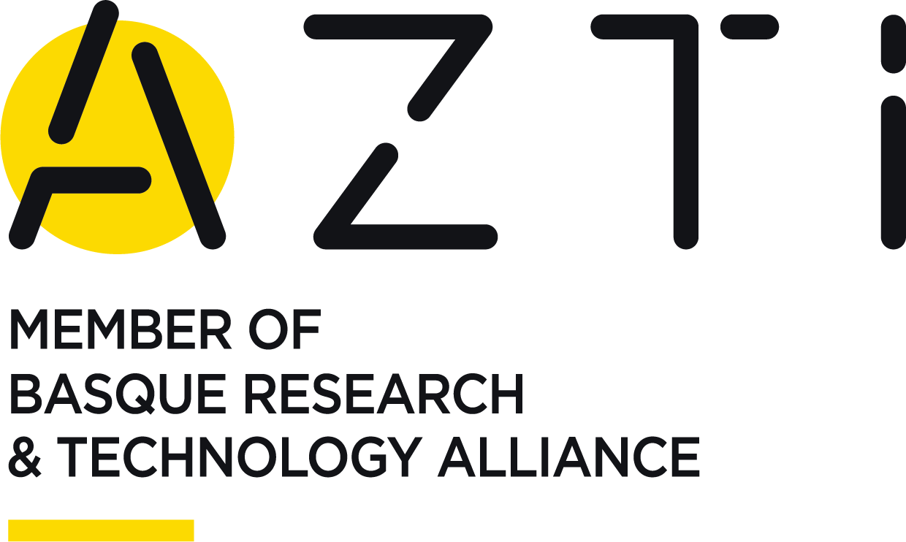

# Introduction

The present e-book is a protocol generated under e-BEGI projecto to guide researchers and technicians from AZTI on how to generate, process, publish and disseminate their research outputs following the FAIR principles and how to assign DOIs to convert them in digital persistent research objects.

“Good data management is not a goal in itself, but rather is the key conduit leading to knowledge discovery and innovation, and to subsequent data and knowledge integration and reuse by the community after the data publication process.”

Wilkinson et al, 2016

This is the first chapter 

This is an example of one citation [@citores_etal_2020]

Test with Lohitzune and Ivan

## Subsection

Below some examples on basic editing. Note that the figures should be placed in the images folder

*italics example*

**bold example**

[azti web page](www.azti.es)

### Subsubsection